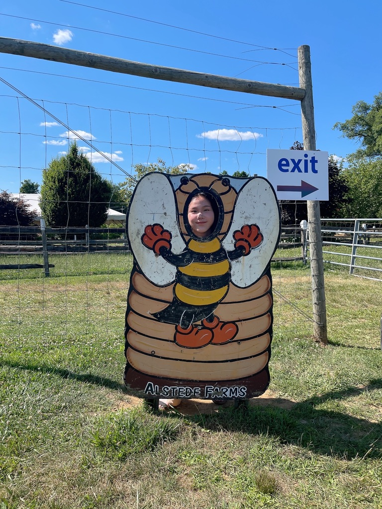

# Welcome to my personal website!

I graduated from Binghamton University in 2022 with BS in Mathematics and Economics. Currently I’m graduate student studying Biostatistics at Mailman school of public health, Columbia University. 

To know me better, please click [here](about.html).
